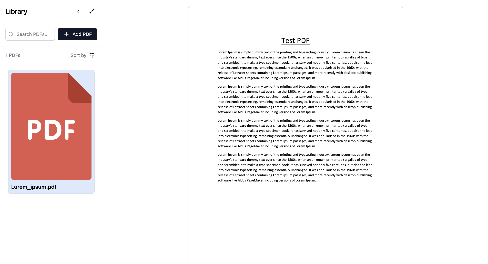

# PDF Reader Application

A modern web application for reading and managing PDF files locally in your browser. Built with React and TypeScript, it provides offline access to your PDF library with fast, client-side storage.

|                                              |                                                 |
| -------------------------------------------- | ----------------------------------------------- |
|  |  |

## 🚀 Technologies

- **React 18** - A JavaScript library for building user interfaces
- **TypeScript** - For type-safe code
- **Vite** - Next Generation Frontend Tooling
- **TanStack Router** - Type-safe routing for React
- **Tailwind CSS** - A utility-first CSS framework
- **Zustand** - A small, fast and scalable state management solution
- **Lucide Icons** - Beautiful & consistent icons
- **Dexie.js** - A wrapper for IndexedDB that provides a better API for client-side storage

## 💾 Data Storage

The application uses IndexedDB through Dexie.js for client-side storage of PDF files. This approach:

- Enables offline access to PDFs
- Provides fast local storage for large files
- Maintains data persistence between sessions
- Allows efficient querying and management of PDF metadata

## 🎨 Design

The UI of this application was designed with the assistance of V0 by Vercel, an AI-powered design tool.

## 📋 Prerequisites

Before you begin, ensure you have the following installed:

- Node.js (version 18.0.0 or higher)
- npm (version 8.0.0 or higher)

## 🛠️ Installation

1. Clone the repository:

```bash
git clone <repository-url>
cd my-pdf-reader
```

2. Install dependencies:

```bash
npm install
```

3. Start the development server:

```bash
npm run dev
```

The application will be available at `http://localhost:5173`

## 🔒 Privacy & Security

- All PDF files are stored locally in your browser
- No data is sent to external servers
- Your files remain private and accessible offline
- IndexedDB storage is isolated to your browser

## 🤝 Contributing

Contributions are welcome! Please feel free to submit a Pull Request.

## 📝 License

This project is licensed under the MIT License - see the [LICENSE](LICENSE) file for details.

## 👥 Authors

- Alexander Rangelov - [Github](https://github.com/arangelovv)
